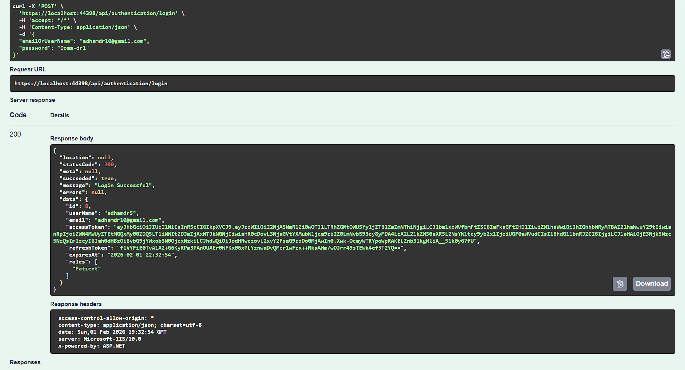
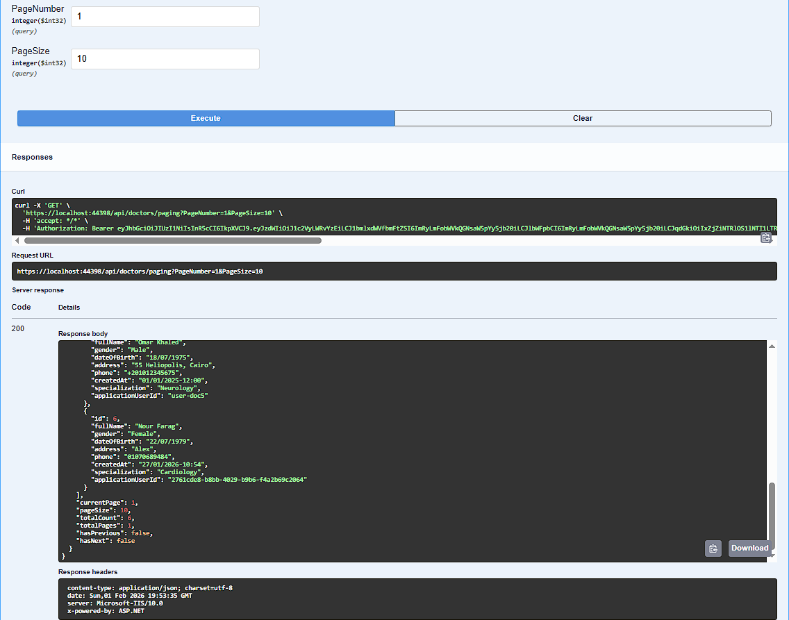
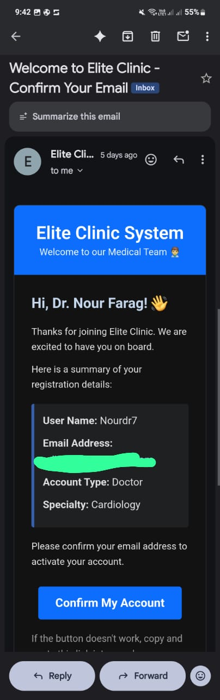

# 🏥 Elite Clinic Management System

A comprehensive, enterprise-grade clinic management system built with **.NET 10.0** following **Clean Architecture** principles and **CQRS** pattern. This system provides a complete solution for managing appointments, patients, doctors, medical records, prescriptions, and payments.

---

## 🚀 Quick Overview (LinkedIn-Ready)

**🏗️ Architecture & Patterns:**
• **Clean Architecture** (4-layer separation: API, Application, Core, Infrastructure, Data)
• **CQRS Pattern** (Command Query Responsibility Segregation)
• **Repository Pattern + Unit of Work**
• **Mediator Pattern** (MediatR)
• **Result Pattern** for unified error handling
• **Vertical Slice Architecture** for feature-based organization

**🛠️ Tech Stack:**
• **ASP.NET Core 10.0** / **.NET 10.0**
• **Entity Framework Core** (ORM)
• **SQL Server**
• **Hangfire** (Background Jobs)
• **Serilog** (Structured Logging)
• **FluentValidation** (Input Validation)
• **AutoMapper** (Object Mapping)
• **JWT + Refresh Tokens** (Authentication)
• **MailKit** (Email Service)

**✨ Key Features:**
• 🔐 **Advanced Security** with Custom Permission System (JWT claims-based)
• 👥 **Complete User/Doctor/Patient Management**
• 📋 **Medical Specializations Management**
• ⚡ **Background Jobs + Structured Logging**
• 🔄 **Global Exception Handling**
• 📧 **Email Notifications** via Hangfire (Future: Event-Driven Architecture with RabbitMQ)

**🎯 Project Highlights:**
• 🏗️ Built from scratch following Clean Architecture principles
• 🔄 Hybrid approach: EF Core for complex queries
• 🔐 Custom Permission-Based Authorization system with JWT claims
• 📝 Complete CQRS implementation with MediatR for clean separation
• 🎨 Vertical Slice Architecture for feature-based organization
• 📧 Email sending via Hangfire (Future: Event-Driven Architecture with RabbitMQ for asynchronous email processing)

---


---

## 📋 Table of Contents

- [Overview](#-overview)
- [Architecture](#-architecture)
- [Features](#-features)
- [Technology Stack](#-technology-stack)
- [Project Structure](#-project-structure)
- [Database Schema](#-database-schema)
- [API Endpoints](#-api-endpoints)
- [Authentication & Authorization](#-authentication--authorization)
- [Email Notifications](#-email-notifications)
- [Background Jobs](#-background-jobs)
- [Getting Started](#-getting-started)
- [Configuration](#-configuration)
- [Future Enhancements](#-future-enhancements)

---

## 🎯 Overview

Elite Clinic is a full-featured clinic management system designed to streamline healthcare operations. It provides role-based access control for **Admins**, **Doctors**, and **Patients**, enabling efficient management of appointments, medical records, prescriptions, and financial transactions.

### Key Highlights

- ✅ **Clean Architecture** - 4-layer separation (API, Application, Core, Infrastructure, Data)
- ✅ **CQRS Pattern** - Command Query Responsibility Segregation with MediatR
- ✅ **Vertical Slice Architecture** - Feature-based organization (Commands/Queries/Handlers per feature)
- ✅ **Result Pattern** - Unified error handling with `Response<T>` wrapper
- ✅ **Repository Pattern + Unit of Work** - Abstraction of data access with transaction management
- ✅ **Custom Permission System** - JWT claims-based authorization (DoctorId/PatientId in tokens)
- ✅ **JWT + Refresh Tokens** - Secure token-based authentication with extended sessions
- ✅ **MailKit Email Service** - Modern SMTP client with HTML templates
- ✅ **Hangfire Background Jobs** - Scheduled tasks (hourly/daily) for appointment expiration & token cleanup
- ✅ **Global Exception Handling** - Centralized error handling middleware
- ✅ **Structured Logging** - Serilog with file-based logging
- ✅ **Soft Delete + Audit Trail** - Data preservation with automatic timestamp tracking

---

## 🎯 Project Highlights

### 🏗️ Built from Scratch
- **Clean Architecture** - Built following Clean Architecture principles from the ground up
- **4-Layer Separation** - Clear boundaries between Presentation, Application, Domain, Infrastructure, and Data layers

### 🔄 Hybrid Approach
- **EF Core for Complex Queries** - Leveraging Entity Framework Core for complex database operations
- **Repository Pattern** - Abstraction layer for data access with Unit of Work pattern

### 🔐 Advanced Security
- **Custom Permission-Based Authorization** - JWT claims-based system with custom claims (DoctorId, PatientId)
- **Role-Based Access Control** - Admin, Doctor, and Patient roles with granular permissions
- **Email Confirmation Required** - Account activation via email verification

### 📝 Complete CQRS Implementation
- **MediatR Integration** - Decoupled request/response handling
- **Command/Query Separation** - Distinct handlers for read and write operations
- **Validation Pipeline** - FluentValidation integrated with MediatR pipeline behaviors

### 🎨 Vertical Slice Architecture
- **Feature-Based Organization** - Each feature contains its own Commands, Queries, Handlers, Validators, and DTOs
- **Self-Contained Features** - Features are organized vertically (not horizontally by layer)

### 📧 Email System
- **MailKit Integration** - Modern SMTP email client
- **Hangfire Email Queue** - Asynchronous email processing via background jobs
- **HTML Email Templates** - Professional email formatting for bookings, confirmations, and password resets
- **Future: Event-Driven Architecture** - Planned integration with RabbitMQ for asynchronous email processing

### ⚡ Background Jobs & Logging
- **Hangfire Scheduled Jobs** - Recurring tasks for appointment expiration and token cleanup
- **Structured Logging** - Serilog with file-based logging (daily rolling)

### 🛡️ Error Handling
- **Result Pattern** - Unified `Response<T>` wrapper for all API responses
- **Global Exception Handling** - Centralized error handling middleware
- **Custom Exceptions** - Domain-specific exceptions with proper HTTP status codes

---

## 🏗️ Architecture

The project follows **Clean Architecture** principles with clear separation of concerns:

```
┌─────────────────────────────────────────────────────────┐
│                    Presentation Layer                    │
│              (Clinic System.API)                         │
│  • Controllers                                           │
│  • Middleware                                            │
│  • Swagger/OpenAPI                                       │
└─────────────────────────────────────────────────────────┘
                            ↓
┌─────────────────────────────────────────────────────────┐
│                 Application Layer                        │
│         (Clinic System.Application)                      │
│  • Features (CQRS Commands/Queries)                     │
│  • DTOs                                                  │
│  • Mapping Profiles                                      │
│  • Business Services                                     │
│  • Validators                                            │
└─────────────────────────────────────────────────────────┘
                            ↓
┌─────────────────────────────────────────────────────────┐
│                    Domain Layer                          │
│            (Clinic System.Core)                          │
│  • Entities                                              │
│  • Interfaces                                            │
│  • Enums                                                 │
│  • Exceptions                                            │
└─────────────────────────────────────────────────────────┘
                            ↓
┌─────────────────────────────────────────────────────────┐
│                  Infrastructure Layer                     │
│      (Clinic System.Infrastructure)                      │
│  • Authentication (JWT)                                  │
│  • Authorization                                         │
│  • Email Service                                         │
│  • Background Jobs (Hangfire)                            │
│  • Identity Management                                   │
└─────────────────────────────────────────────────────────┘
                            ↓
┌─────────────────────────────────────────────────────────┐
│                    Data Layer                            │
│            (Clinic System.Data)                          │
│  • DbContext                                             │
│  • Repositories                                          │
│  • Unit of Work                                          │
│  • Entity Configurations                                 │
│  • Migrations                                            │
└─────────────────────────────────────────────────────────┘
```

### Design Patterns Used

- **CQRS (Command Query Responsibility Segregation)** - Separate read and write operations for optimal performance
- **Repository Pattern** - Abstraction of data access layer
- **Unit of Work** - Transaction management and consistency
- **Mediator Pattern** - Decoupled communication via MediatR
- **Result Pattern** - Unified error handling with `Response<T>` wrapper
- **Vertical Slice Architecture** - Feature-based organization (Commands/Queries/Handlers per feature)

---

## ✨ Features

### 🔐 Authentication & User Management

- **User Registration** - Secure user registration with email confirmation
- **Login/Logout** - JWT-based authentication
- **Email Confirmation** - Email verification required before account activation
- **Password Reset** - Secure password reset via email
- **Refresh Tokens** - Token refresh mechanism for extended sessions
- **Profile Management** - Update user profile information
- **Password Change** - Change password functionality
- **Role-Based Access Control** - Admin, Doctor, and Patient roles

### 👨‍⚕️ Doctor Management

- **Create Doctor** - Register new doctors with specialization
- **Update Doctor** - Modify doctor information
- **Get Doctor List** - Retrieve all doctors with pagination
- **Get Doctor by ID** - Fetch detailed doctor information
- **Get Doctor by Specialization** - Filter doctors by medical specialty
- **Get Doctor by Name** - Search doctors by name
- **Get Doctor with Appointments** - View doctor's appointment history
- **Soft Delete** - Mark doctors as deleted (preserves data)
- **Hard Delete** - Permanently remove doctors (admin only)

### 👤 Patient Management

- **Create Patient** - Register new patients (public endpoint)
- **Update Patient** - Modify patient information
- **Get Patient List** - Retrieve all patients with pagination
- **Get Patient by ID** - Fetch detailed patient information
- **Get Patient by Phone** - Search patients by phone number
- **Get Patient by Name** - Search patients by name
- **Get Patient with Appointments** - View patient's appointment history
- **Soft Delete** - Mark patients as deleted
- **Hard Delete** - Permanently remove patients (admin only)

### 📅 Appointment Management

- **Book Appointment** - Schedule new appointments
- **Confirm Appointment** - Confirm pending appointments
- **Reschedule Appointment** - Change appointment date/time
- **Complete Appointment** - Mark appointments as completed (doctor only)
- **Cancel Appointment** - Cancel appointments (with 1-hour minimum notice)
- **No-Show Appointment** - Mark appointments as no-show
- **Get Available Slots** - View available appointment time slots
- **Get Patient Appointments** - Retrieve all appointments for a patient
- **Get Doctor Appointments** - Retrieve all appointments for a doctor
- **Get Appointments by Status** - Filter appointments by status (Pending, Confirmed, Completed, etc.)
- **Get Past Appointments** - View historical appointments
- **Appointment Statistics** - Admin dashboard with appointment metrics
- **Automatic Expiration** - Background job cancels overdue pending appointments

#### Appointment Status Flow

```
Pending → Confirmed → Completed
    ↓         ↓
Cancelled  Rescheduled
    ↓
No-Show
```

### 💊 Medical Records

- **Create Medical Record** - Create records after appointment completion
- **Update Medical Record** - Modify diagnosis, description, and notes
- **Get Medical Record by ID** - Fetch detailed medical record
- **Get Patient History** - View complete medical history for a patient
- **Get Records by Doctor** - View all records created by a doctor

### 💉 Prescription Management

- **Create Prescription** - Add prescriptions to medical records
- **Update Prescription** - Modify medication details
- **Delete Prescription** - Remove prescriptions
- **Prescription Details** - Medication name, dosage, frequency, start/end dates, special instructions

### 💳 Payment Management

- **Create Payment** - Generate payment records for appointments
- **Update Payment** - Modify payment details
- **Get Payment by ID** - Fetch detailed payment information
- **Get All Payments** - List all payments with filtering
- **Daily Revenue Report** - View daily revenue statistics
- **Doctor Revenue Report** - Calculate revenue per doctor
- **Payment Methods** - Cash, Credit Card, InstaPay
- **Payment Status Tracking** - Pending, Paid, Failed, Refunded, Cancelled

### 🔑 Role Management

- **Promote Doctor to Admin** - Elevate doctor privileges to admin (admin only)

---

## 🛠️ Technology Stack

### Backend Framework
- **.NET 10.0** - Latest .NET framework
- **ASP.NET Core Web API** - RESTful API framework
- **Entity Framework Core 10.0** - ORM with SQL Server
- **Lazy Loading Proxies** - Efficient data loading

### Authentication & Security
- **ASP.NET Core Identity** - User management
- **JWT Bearer Authentication** - Token-based authentication
- **Password Hashing** - Secure password storage
- **Email Confirmation** - Account verification
- **Refresh Tokens** - Extended session management

### Design Patterns & Libraries
- **MediatR** - CQRS implementation
- **AutoMapper** - Object-to-object mapping
- **FluentValidation** - Input validation
- **Serilog** - Structured logging

### Background Processing
- **Hangfire** - Background job processing
- **Recurring Jobs** - Scheduled tasks (hourly/daily)

### Email Services
- **MailKit** - Modern SMTP email client library
- **HTML Email Templates** - Professional email formatting
- **Hangfire Email Queue** - Asynchronous email processing

### API Documentation
- **Swagger/OpenAPI** - API documentation and testing
- **Swagger Annotations** - Enhanced API documentation

### Database
- **SQL Server** - Relational database
- **Entity Framework Migrations** - Database versioning

### Development Tools
- **Serilog File Sink** - File-based logging
- **CORS** - Cross-origin resource sharing
- **Error Handling Middleware** - Centralized exception handling

---

## 📁 Project Structure

```
Clinic System.API/
├── Controllers/          # API Controllers
│   ├── AppointmentController.cs
│   ├── AuthenticationController.cs
│   ├── DoctorController.cs
│   ├── MedicalRecordController.cs
│   ├── PatientController.cs
│   ├── PaymentController.cs
│   ├── PrescriptionsController.cs
│   └── RoleController.cs
├── Bases/                # Base controller
├── Middlewares/          # Custom middleware
├── Program.cs            # Application entry point
└── appsettings.json      # Configuration

Clinic System.Application/
├── Features/            # CQRS Commands & Queries
│   ├── Appointments/
│   ├── Authentication/
│   ├── Authorization/
│   ├── Doctors/
│   ├── MedicalRecords/
│   ├── Patients/
│   ├── Payment/
│   └── Prescriptions/
├── DTOs/                # Data Transfer Objects
├── Mapping/             # AutoMapper profiles
├── Service/             # Business services
└── Common/              # Shared utilities

Clinic System.Core/
├── Entities/            # Domain entities
├── Interfaces/          # Repository interfaces
├── Enums/               # Enumerations
└── Exceptions/          # Custom exceptions

Clinic System.Data/
├── Context/             # DbContext
├── Repository/          # Repository implementations
├── Configurations/      # EF Core configurations
└── Migrations/          # Database migrations

Clinic System.Infrastructure/
├── Authentication/      # JWT authentication
├── Authorization/       # Authorization policies
├── Identity/            # Identity management
├── Services/            # Infrastructure services
└── Helpers/             # Utility classes
```

---

## 🗄️ Database Schema

The system uses a relational database with the following main entities:


### Entity Relationships

- **ApplicationUser** (Identity) ↔ **Doctor** / **Patient** (One-to-One)
- **Doctor** ↔ **Appointment** (One-to-Many)
- **Patient** ↔ **Appointment** (One-to-Many)
- **Appointment** ↔ **MedicalRecord** (One-to-One)
- **Appointment** ↔ **Payment** (One-to-One)
- **MedicalRecord** ↔ **Prescription** (One-to-Many)
- **ApplicationUser** ↔ **RefreshToken** (One-to-Many)

### Key Entities

#### Person (Abstract Base Class)
- `Id` - Primary key
- `FullName` - Full name
- `Gender` - Gender (Male/Female)
- `DateOfBirth` - Date of birth
- `Address` - Address
- `Phone` - Phone number
- `IsDeleted` - Soft delete flag
- `DeletedAt` - Deletion timestamp
- `CreatedAt` - Creation timestamp
- `UpdatedAt` - Update timestamp

#### Doctor (Inherits from Person)
- `Specialization` - Medical specialty
- `ApplicationUserId` - Foreign key to Identity user
- `Appointments` - Collection of appointments

#### Patient (Inherits from Person)
- `ApplicationUserId` - Foreign key to Identity user
- `Appointments` - Collection of appointments

#### Appointment
- `Id` - Primary key
- `AppointmentDate` - Scheduled date and time
- `Status` - Appointment status (Pending, Confirmed, Completed, etc.)
- `PatientId` - Foreign key to Patient
- `DoctorId` - Foreign key to Doctor
- `MedicalRecord` - Associated medical record
- `Payment` - Associated payment

#### MedicalRecord
- `Id` - Primary key
- `Diagnosis` - Diagnosis information
- `DescriptionOfTheVisit` - Visit description
- `AdditionalNotes` - Additional notes
- `AppointmentId` - Foreign key to Appointment
- `Prescriptions` - Collection of prescriptions

#### Prescription
- `Id` - Primary key
- `MedicationName` - Name of medication
- `Dosage` - Dosage information
- `Frequency` - Frequency of administration
- `StartDate` - Start date
- `EndDate` - End date
- `SpecialInstructions` - Special instructions
- `MedicalRecordId` - Foreign key to MedicalRecord

#### Payment
- `Id` - Primary key
- `AmountPaid` - Payment amount
- `PaymentDate` - Payment date
- `PaymentMethod` - Payment method (Cash, CreditCard, InstaPay)
- `PaymentStatus` - Payment status (Pending, Paid, Failed, etc.)
- `AdditionalNotes` - Additional notes
- `AppointmentId` - Foreign key to Appointment

---

## 🔌 API Endpoints

### Authentication Endpoints

| Method | Endpoint | Description | Auth Required |
|--------|----------|-------------|---------------|
| POST | `/api/authentication/login` | User login | No |
| POST | `/api/authentication/refresh-token` | Refresh access token | No |
| GET | `/api/authentication/confirm-email` | Confirm email address | No |
| POST | `/api/authentication/resend-confirmation-email` | Resend confirmation email | No |
| POST | `/api/authentication/send-reset-password` | Send password reset link | No |
| POST | `/api/authentication/reset-password` | Reset password | No |
| PUT | `/api/authentication/update-profile` | Update user profile | Yes |
| PUT | `/api/authentication/change-password` | Change password | Yes |

### Doctor Endpoints

| Method | Endpoint | Description | Roles |
|--------|----------|-------------|-------|
| GET | `/api/doctors` | Get all doctors | Admin |
| GET | `/api/doctors/paging` | Get doctors with pagination | Admin |
| GET | `/api/doctors/{id}` | Get doctor by ID | Admin, Doctor |
| GET | `/api/doctors/{id}/appointments` | Get doctor with appointments | Admin, Doctor |
| GET | `/api/doctors/specializations/{specialization}` | Get doctors by specialization | Public |
| GET | `/api/doctors/name/{name}` | Get doctors by name | Public |
| POST | `/api/doctors` | Create doctor | Admin |
| PUT | `/api/doctors/{id}` | Update doctor | Admin, Doctor |
| DELETE | `/api/doctors/{id}` | Soft delete doctor | Admin |
| DELETE | `/api/doctors/{id}/hard` | Hard delete doctor | Admin |

### Patient Endpoints

| Method | Endpoint | Description | Roles |
|--------|----------|-------------|-------|
| GET | `/api/patients` | Get all patients | Admin |
| GET | `/api/patients/paging` | Get patients with pagination | Admin |
| GET | `/api/patients/{id}` | Get patient by ID | Admin, Doctor, Patient |
| GET | `/api/patients/{id}/appointments` | Get patient with appointments | Admin, Patient |
| GET | `/api/patients/phone/{phone}` | Get patient by phone | Admin, Doctor |
| GET | `/api/patients/name/{name}` | Get patients by name | Admin |
| POST | `/api/patients/create` | Create patient | Public |
| PUT | `/api/patients/{id}` | Update patient | Admin, Patient |
| DELETE | `/api/patients/{id}` | Soft delete patient | Admin, Patient |
| DELETE | `/api/patients/{id}/hard` | Hard delete patient | Admin |

### Appointment Endpoints

| Method | Endpoint | Description | Roles |
|--------|----------|-------------|-------|
| GET | `/api/appointments/stats` | Get appointment statistics | Admin |
| GET | `/api/appointments/AvailableSlots` | Get available time slots | All |
| GET | `/api/appointments/doctor` | Get doctor appointments | Admin, Doctor |
| GET | `/api/appointments/patient` | Get patient appointments | Admin, Patient |
| GET | `/api/appointments/statusforadmin` | Get appointments by status (admin) | Admin |
| GET | `/api/appointments/statusfordoctor` | Get appointments by status (doctor) | Admin, Doctor |
| GET | `/api/appointments/pastforpatient` | Get past patient appointments | Admin, Patient |
| GET | `/api/appointments/pastfordoctor` | Get past doctor appointments | Admin, Doctor |
| POST | `/api/appointments/book` | Book appointment | Admin, Patient |
| PUT | `/api/appointments/confirm` | Confirm appointment | Admin, Patient |
| PUT | `/api/appointments/complete` | Complete appointment | Admin, Doctor |
| PUT | `/api/appointments/reschedule` | Reschedule appointment | Admin, Patient |
| PUT | `/api/appointments/noshow` | Mark as no-show | Admin, Doctor |
| PUT | `/api/appointments/cancel` | Cancel appointment | Admin, Patient |

### Medical Record Endpoints

| Method | Endpoint | Description | Roles |
|--------|----------|-------------|-------|
| GET | `/api/medicalrecords/{id}` | Get medical record by ID | All |
| GET | `/api/medicalrecords/patient` | Get patient history | All |
| GET | `/api/medicalrecords/doctor` | Get records by doctor | Admin, Doctor |
| PUT | `/api/medicalrecords/{id}` | Update medical record | Admin, Doctor |

### Prescription Endpoints

| Method | Endpoint | Description | Roles |
|--------|----------|-------------|-------|
| POST | `/api/prescription` | Create prescription | Admin, Doctor |
| PUT | `/api/prescription/{id}` | Update prescription | Admin, Doctor |
| DELETE | `/api/prescription/{id}` | Delete prescription | Admin, Doctor |

### Payment Endpoints

| Method | Endpoint | Description | Roles |
|--------|----------|-------------|-------|
| GET | `/api/payment/list` | Get all payments | Admin |
| GET | `/api/payment/{id}` | Get payment by ID | Admin, Doctor, Patient |
| GET | `/api/payment/daily-revenue` | Get daily revenue | Admin |
| GET | `/api/payment/doctor-revenue` | Get doctor revenue | Admin, Doctor |
| PUT | `/api/payment/{id}` | Update payment | Admin |

### Role Endpoints

| Method | Endpoint | Description | Roles |
|--------|----------|-------------|-------|
| POST | `/api/role/promote-doctor` | Promote doctor to admin | Admin |

---

## 🔐 Authentication & Authorization

### JWT Authentication

The system uses **JWT (JSON Web Tokens)** for secure authentication:

- **Access Token** - Short-lived token for API access
- **Refresh Token** - Long-lived token for obtaining new access tokens
- **Token Validation** - Validates issuer, audience, lifetime, and signing key

### Password Requirements

- Minimum 8 characters
- At least one digit
- At least one lowercase letter
- At least one uppercase letter
- At least one non-alphanumeric character

### Account Lockout

- Maximum 5 failed login attempts
- Lockout duration: 5 minutes
- Lockout enabled for new users

### Email Confirmation

- Email confirmation required before login
- Resend confirmation email functionality
- Secure token-based confirmation

### Roles

1. **Admin** - Full system access
2. **Doctor** - Access to appointments, medical records, prescriptions
3. **Patient** - Access to own appointments and medical records

---

## 📧 Email Notifications

The system includes comprehensive email notification features:

### Email Templates



### Booking Confirmation Email

When a patient books an appointment, they receive a confirmation email with:
- Appointment details (date, time, doctor)
- Confirmation link
- Clinic information

.png)

### Password Reset Email

Users can request password reset and receive:
- Secure reset link
- Token expiration information
- Security instructions

.png)

### Email Confirmation

New users receive:
- Welcome message
- Email confirmation link
- Account activation instructions

.png)

### Email Service Configuration

The email service supports:
- SMTP configuration
- HTML email templates
- Async email sending
- Error handling and logging

---

## ⚙️ Background Jobs

The system uses **Hangfire** for background job processing:

### Scheduled Jobs

1. **Cancel Overdue Appointments** (Hourly)
   - Automatically cancels pending appointments that have passed
   - Runs every hour via cron expression

2. **Cleanup Expired Refresh Tokens** (Daily)
   - Removes expired refresh tokens from the database
   - Runs daily to maintain database cleanliness

### Hangfire Dashboard

Access the Hangfire dashboard at `/hangfire` to:
- Monitor job execution
- View job history
- Retry failed jobs
- Schedule new jobs

---

## 🚀 Getting Started

### Prerequisites

- **.NET 10.0 SDK** or later
- **SQL Server** 2019 or later
- **Visual Studio 2022** or **VS Code** (recommended)
- **Git** for version control

### Installation Steps

1. **Clone the repository**
   ```bash
   git clone <repository-url>
   cd "Clinic System.API"
   ```

2. **Restore NuGet packages**
   ```bash
   dotnet restore
   ```

3. **Configure database connection**
   - Update `appsettings.json` with your SQL Server connection string:
   ```json
   {
     "constr": "Server=localhost;Database=EliteClinicDB;Trusted_Connection=True;TrustServerCertificate=True;"
   }
   ```

4. **Configure JWT settings**
   ```json
   {
     "JWT": {
       "SecritKey": "YourSecretKeyHere_MustBeAtLeast32Characters",
       "IssuerIP": "https://localhost:7000",
       "AudienceIP": "https://localhost:7000"
     }
   }
   ```

5. **Configure Email settings**
   ```json
   {
     "EmailSettings": {
       "SmtpServer": "smtp.gmail.com",
       "SmtpPort": 587,
       "SenderEmail": "your-email@gmail.com",
       "SenderPassword": "your-app-password"
     }
   }
   ```

6. **Run database migrations**
   ```bash
   cd "Clinic System.Data"
   dotnet ef database update --startup-project "../Clinic System.API"
   ```

7. **Run the application**
   ```bash
   cd "Clinic System.API"
   dotnet run
   ```

8. **Access Swagger UI**
   - Navigate to `https://localhost:7000/swagger` (or your configured port)

---

## ⚙️ Configuration

### Application Settings

Key configuration sections in `appsettings.json`:

```json
{
  "constr": "Your connection string",
  "JWT": {
    "SecritKey": "Your JWT secret key",
    "IssuerIP": "Token issuer",
    "AudienceIP": "Token audience"
  },
  "EmailSettings": {
    "SmtpServer": "SMTP server address",
    "SmtpPort": 587,
    "SenderEmail": "Sender email address",
    "SenderPassword": "Sender password"
  },
  "ClinicSettings": {
    "ClinicName": "Elite Clinic",
    "ClinicAddress": "Your clinic address",
    "ClinicPhone": "Your clinic phone"
  }
}
```

### Logging Configuration

Serilog is configured for:
- Console logging
- File logging (daily rolling)
- Structured logging

Log files are stored in the `Logs/` directory.

---

## 📊 Key DTOs (Data Transfer Objects)

The system uses comprehensive DTOs for data transfer:

### Appointment DTOs
- `BookAppointmentDTO` - Booking request
- `ConfirmAppointmentDTO` - Confirmation request
- `AppointmentDTO` - Appointment details
- `PatientAppointmentDTO` - Patient view
- `DoctorAppointmentDTO` - Doctor view
- `AvailableSlotDTO` - Available time slots

### Patient DTOs
- `CreatePatientDTO` - Patient registration
- `UpdatePatientDTO` - Patient update
- `GetPatientDTO` - Patient details
- `GetPatientListDTO` - Patient list
- `GetPatientWhitAppointmentDTO` - Patient with appointments

### Doctor DTOs
- `CreateDoctorDTO` - Doctor registration
- `UpdateDoctorDTO` - Doctor update
- `GetDoctorDTO` - Doctor details
- `GetDoctorListDTO` - Doctor list
- `GetDoctorWhitAppointmentDTO` - Doctor with appointments

### Medical Record DTOs
- `MedicalRecordDTO` - Medical record details
- `MedicalRecordPatientHistoryDTO` - Patient history
- `MedicalRecordDoctorDTO` - Doctor's records
- `UpdateMedicalRecordDTO` - Update request

### Payment DTOs
- `PaymentDTO` - Payment details
- `PaymentDetailsDTO` - Detailed payment info
- `DailyRevenueDTO` - Daily revenue report
- `DoctorRevenueDTO` - Doctor revenue report

### Authentication DTOs
- `LoginResponseDTO` - Login response with tokens
- `UserDTO` - User information

---

## 🎨 Screenshots

### Database Schema


### Email Templates

.png)
.png)
.png)

### Additional Screenshots




---

## 🔮 Future Enhancements

The following features are planned for future releases:

### 📱 SMS Notifications
- SMS reminders for upcoming appointments
- SMS notifications for appointment confirmations
- Two-factor authentication via SMS

### 🐳 Docker Support
- Docker containerization for easy deployment
- Docker Compose for multi-container orchestration
- Production-ready Docker images

### 🧪 Testing
- **Unit Tests** - Comprehensive unit test coverage
  - Service layer tests
  - Handler tests
  - Repository tests
  - Validation tests
- **Integration Tests** - End-to-end API testing
  - Controller integration tests
  - Database integration tests
  - Authentication flow tests

### 📈 Additional Features
- **Event-Driven Architecture** - RabbitMQ integration for asynchronous email processing
- Real-time notifications using SignalR
- Advanced reporting and analytics dashboard
- Mobile app support (iOS/Android)
- Telemedicine video consultation integration
- Electronic health records (EHR) export
- Multi-language support
- Advanced search and filtering
- Appointment reminders (email + SMS)
- Payment gateway integration
- Inventory management for medications
- Lab results management
- Insurance claim processing

---

## 📝 License

This project is licensed under the MIT License.

---

## 👥 Contributing

Contributions are welcome! Please feel free to submit a Pull Request.

---

## 📞 Support

For support, please open an issue in the repository or contact the development team.

---

## 🙏 Acknowledgments

- Built with ❤️ using .NET 10.0
- Clean Architecture principles
- CQRS pattern implementation
- Modern ASP.NET Core best practices

---

**Made with dedication for efficient healthcare management** 🏥


